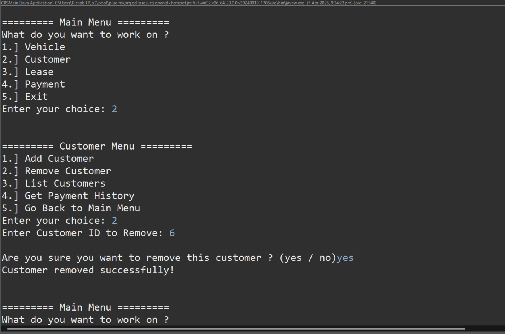
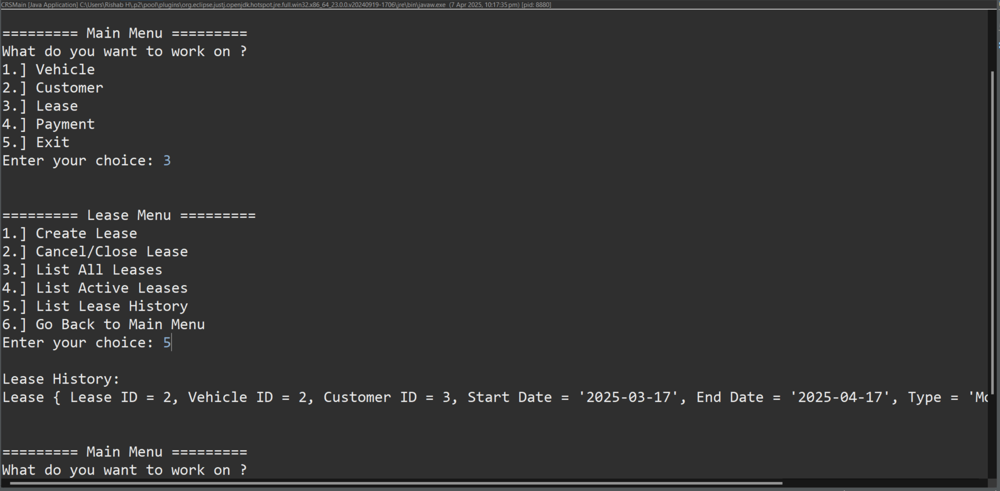

# Car Rental System - Case Study - Hexaware
<i>Java Training Batch 5 
J514 - Rishab H</i>

---

## 📁 Current Structure
<pre>
CarRentalSystem/
└── src/
&nbsp;&nbsp;&nbsp;&nbsp;├── dao/
&nbsp;&nbsp;&nbsp;&nbsp;│   ├── ICarLeaseRepository.java
&nbsp;&nbsp;&nbsp;&nbsp;│   └── CarLeaseRepositoryImpl.java 
&nbsp;&nbsp;&nbsp;&nbsp;├── entity/
&nbsp;&nbsp;&nbsp;&nbsp;│   ├── Customer.java
&nbsp;&nbsp;&nbsp;&nbsp;│   ├── Lease.java
&nbsp;&nbsp;&nbsp;&nbsp;│   ├── Payment.java
&nbsp;&nbsp;&nbsp;&nbsp;│   └── Vehicle.java
&nbsp;&nbsp;&nbsp;&nbsp;├── exception/
&nbsp;&nbsp;&nbsp;&nbsp;│   ├── CarNotFoundException.java
&nbsp;&nbsp;&nbsp;&nbsp;│   ├── CustomerNotFoundException.java
&nbsp;&nbsp;&nbsp;&nbsp;│   └── LeaseNotFoundException.java 
&nbsp;&nbsp;&nbsp;&nbsp;├── main/
&nbsp;&nbsp;&nbsp;&nbsp;│   ├── CRSMain.java
&nbsp;&nbsp;&nbsp;&nbsp;│   └── CarRentalSer.java
&nbsp;&nbsp;&nbsp;&nbsp;├── test/
&nbsp;&nbsp;&nbsp;&nbsp;|   ├── CarRentalSystemTest.java
&nbsp;&nbsp;&nbsp;&nbsp;│   └── TestDBConnection.java
&nbsp;&nbsp;&nbsp;&nbsp;└── util/
&nbsp;&nbsp;&nbsp;&nbsp;&nbsp;&nbsp;&nbsp;&nbsp;└── DBConnUtil.java

Other repository contents:
<ul>
<li>Requirements-Document/ → Contains project specification and requirement details (Given by Hexaware)</li> 
<li>SampleOutputs/ → Screenshots demonstrating system functionality and CLI outputs</li>
<li>CarRentalDB.sql → SQL script for creating and initializing the database schema</li>
</ul>
</pre>

---

## 📄 Java Files Overview

### `CRSMain.java`
Main class with CLI menu to navigate through car, customer, lease, and payment operations.

### `CarRentalSer.java`
Service layer implementation handling user input and coordinating DAO operations.

### `ICarLeaseRepository.java`
Interface defining contract for car rental operations (add/remove cars, customers, leases, etc.).

### `CarLeaseRepositoryImpl.java`
Implements the logic to interact with the database for all core functionalities.

### `Customer.java`
Represents customer entity with attributes like name, contact details, customer ID, etc.

### `Lease.java`
Represents a car lease, including customer, vehicle, lease duration, status, etc.

### `Payment.java`
Represents a payment record including amount, payment date, etc.

### `Vehicle.java`
Represents vehicle entity with details such as model, capacity, fuel type, etc.

### `CarNotFoundException.java`
Custom exception thrown when a car record is not found in the database.

### `CustomerNotFoundException.java`
Custom exception thrown when a customer record is not found.

### `LeaseNotFoundException.java`
Custom exception thrown when a lease record is not found.

### `TestDBConnection.java`
Tests the database connection using utility methods.

### `DBConnUtil.java`
Utility class to establish a connection with the MySQL database.

---

## 🔗 Referenced Library

- [MySQLConnector-9.2.0](https://dev.mysql.com/downloads/connector/j/?os=26) – Used for connecting the application to MySQL database.

---

### 🧪 JUnit  
Used for unit testing core functionalities like adding/removing cars and customers, lease creation, payment recording, and listing records.

### ✅ Tests 
- testAddCar()
- testRemoveCar()
- testAddCustomer()
- testRemoveCustomer()
- testCreateAndEndLease()
- testRecordPayment()
- testGetTotalRevenue()
- testListCustomers()
- testListAvailableCars()
- testListRentedCars()
- testListLeases()
- testListActiveLeases()
- testListLeaseHistory()
- testGetPaymentHistoryOfCustomer()

✅ **14 / 14 TestCases Passed**

### JUnit Test Case 1 to 8
  
### JUnit Test Case 9 to 14

---

## 📸 Sample Outputs

### Main Menu

### Add Car

### Available Cars

### Remove Car

### Remove Car (Abort)

### Add Customer

### List Customers

### Remove Customer

### Create Lease

### List All Leases

### Close Lease

### Active Leases

### Lease History

### Record Payment

### Total Revenue

### Payment History of Customer (From Payment Menu)

### List Rented Cars

### Get Payment History (From Customer Menu)

